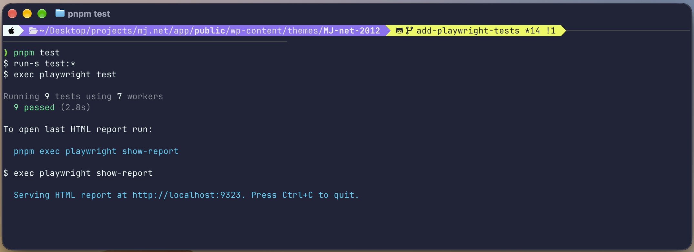
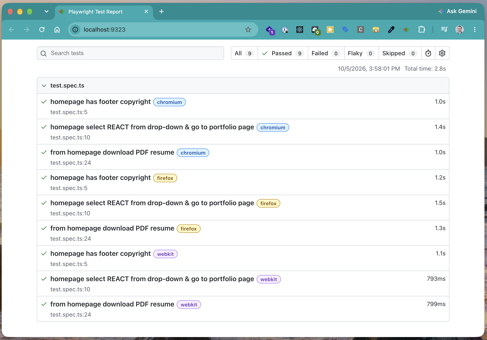

# Matt Jenning's WordPress Portfolio
This repo is code for [mattjennings.net](https://www.mattjennings.net/), the portfolio of Matt Jennings, front-end and full-stack web developer with design skills.

## Tech Details (for recruiters or hiring managers to read)
Below are code details about the active WordPress (WP) theme is at:  
__wp-content/themes/MJ-net-2012__

## pnpm and Vite
- [pnmp](https://pnpm.io/) instead of npm
- [Vite](https://vite.dev/) is used to transpile:
  - [SCSS](https://sass-lang.com/documentation/syntax/#scss) into CSS at:  
    __wp-content/themes/MJ-net-2012/assets/scss__
  - ES6 and beyond JavaScript (JS) into minified and ES5 (or higher) JS at:  
    __wp-content/themes/MJ-net-2012/assets/js__
- For Vite configuration details see (3 files):
  - __wp-content/themes/MJ-net-2012/vite.config.js__  
  - __wp-content/themes/MJ-net-2012/package.json__ (see `scripts` entry)  

## Linting and Auto-formatting for JS and SCSS
See the files below:
- [ESLint](https://eslint.org/) (for JS)  
  __wp-content/themes/MJ-net-2012/eslint.config.js__
- [Stylelint](https://stylelint.io/) (for SCSS)  
  __wp-content/themes/MJ-net-2012/.stylelintrc.json__
- [Prettier](https://prettier.io/) (auto-formatting of JS and SCSS; 2 files)  
  - __wp-content/themes/MJ-net-2012/.prettierrc.json__  
  - __wp-content/themes/MJ-net-2012/.prettierignore__

## Active WP Theme's functions.php File
- Shows example of linking to files with OOP PHP to execute [WP hooks](https://developer.wordpress.org/plugins/hooks/):  
  __wp-content/themes/MJ-net-2012/functions.php__
- Files with OOP PHP code linked to WP theme's __functions.php__ file:
  - WP Core Utilities (WP core hooks):  
    __wp-content/themes/MJ-net-2012/inc/wp-core-utils/wp-core-utils.php__
  - Example of Using [Walker_Nav_Menu](https://developer.wordpress.org/reference/classes/walker_nav_menu/) WordPress Class:  
    __wp-content/themes/MJ-net-2012/inc/walker-nav-menu/walker-nav-menu.php__

## JS and SCSS Files in Active WP Theme
- JS code:  
  __[wp-content/themes/MJ-net-2012/assets/js/theme.js](https://github.com/Hollyw00d/mattjennings_net/blob/develop/wp-content/themes/MJ-net-2012/assets/js/theme.js)__
- SCSS code:  
  __[wp-content/themes/MJ-net-2012/assets/scss/style.scss](https://github.com/Hollyw00d/mattjennings_net/blob/develop/wp-content/themes/MJ-net-2012/assets/scss/style.scss)__  
  
## Setup
1. To update CSS or JS in the WP active theme (both are located at __wp-content/themes/MJ-net-2012/assets__ and I use [SCSS](https://sass-lang.com/documentation/syntax/#scss), which is enhanced CSS), in your terminal go to:  
  __wp-content/themes/MJ-net-2012__

2. Then install npm packages (including [webpack](https://webpack.js.org/)) do with pnpm:  
   `pnpm i`

3. To build CSS and JS for the theme do:  
   `pnpm build`

4. When doing localhost development on the website, do:  
   `pnpm start`

5. Additional useful terminal commands in the active theme are below:
   - Lint WP theme JS located at __wp-content/themes/MJ-net-2012/assets/js__ by running:  
     `pnpm lint`
   - Reformat JS located at __wp-content/themes/MJ-net-2012/assets/js__ by running:  
     `pnpm format`

## Tests
[Playwright](https://playwright.dev/) tests for [mattjennings.net](https://www.mattjennings.net/) are included. To use them:
1. Go to __wp-content/themes/MJ-net-2012__ and follow the `Setup` instructions above

2. Then still inside of __wp-content/themes/MJ-net-2012__, do:  
   `pnpm test`

3. Then you will see test results like the example below that appear in your terminal or browser:  
   - Terminal Example:  
     
   - Browser example:  
     
